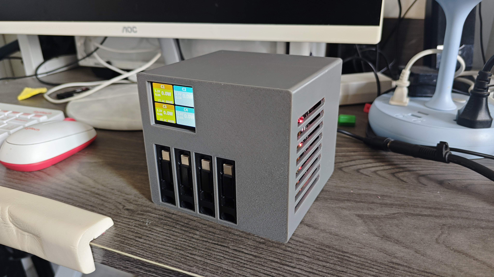

# DIY 桌面充电站 — 4通道快充电源中心

## 项目简介


一款基于 ESP32 和 SW3518S 的桌面多口快充站，支持 4 路独立充电输出，实时显示电压、电流、功率、温度及快充协议，配备智能温控风扇散热系统。

外壳采用 3D 打印，内置伸缩线收纳，适合桌面使用场景，桌搭神器。

## 资源下载

所有文件（代码、3D 模型、效果图、文档）已打包上传百度网盘：

> **链接**: https://pan.baidu.com/s/1qrNd99SgLYCtQXMKIeC5Bg?pwd=52ki
> **提取码**: 52ki

压缩包内容：
- `代码/` — Arduino 固件源码
- `模型/` — 3D 打印外壳 .3mf 文件（主体、盖子、底座）
- `文档/` — 物料清单、配件参考图
- `效果图/` — 实物照片

## 功能特性

- **4 路独立快充输出** — 每路搭载 SW3518S 快充模块，最高 100W 输出
- **全协议支持** — QC2/QC3、FCP、SCP、PD、PPS、AFC 自动识别
- **实时数据监测** — 1.8寸 TFT 彩色屏，2×2 卡片式 UI 展示电压/电流/功率/温度/协议
- **智能温控风扇** — PWM MOS 管控制 5V 散热风扇，任意通道有负载时自动启动
- **伸缩线收纳** — 4 根 100W 伸缩线，桌面整洁不凌乱
- **紧凑桌面设计** — 3D 打印外壳，一体化电路布局

## 物料清单

### 电子元件

| 序号 | 物料 | 数量 | 备注 |
|------|------|------|------|
| 1 | ESP32 Dev 开发板 | 1 | |
| 2 | SW3518S 快充模块 | 4 | 核心充电模块 |
| 3 | TCA9548A I2C 多路复用模块 | 1 | 解决 SW3518 地址冲突 |
| 4 | 1.8寸 TFT SPI 显示屏 (ST7735) | 1 | 128×160 分辨率 |
| 5 | DC-DC 5V 邮票孔降压模块 | 1 | 给 ESP32 供电 |
| 6 | MOS 管 PWM 电子开关模块 | 1 | 风扇调速 |
| 7 | DC 5V 5cm 风扇 | 1 | 厚度 1cm |
| 8 | DC-022B 5.5×2.1 电源插座 | 1 | 总电源输入 |
| 9 | 2脚船型开关 10×15mm | 1 | 总电源开关 |
| 10 | 5.08mm 2P 接线端子 (KF2EDG) | 1 | 电源输入端子 |

### 线材与连接器

| 序号 | 物料 | 数量 | 备注 |
|------|------|------|------|
| 11 | 伸缩线 (100W) | 4 | 注意：66W 版本尺寸不对，需买 100W |
| 12 | 2芯 0.75平方线缆 5米 | 1 | 主电源线 |
| 13 | XH2.54 单头 2P 20cm | 3 | 内部连接线 |
| 14 | XH2.54 单头 3P 20cm | 4 | 内部连接线 |
| 15 | XH2.54 单头 8P 20cm | 1 | 显示屏连接线 |
| 16 | 单排母座 2.54mm 15P | 4 | 模块插拔座 |
| 17 | XH2.54 直针 3P | 4 | 焊接针脚 |
| 18 | XH2.54 直针 2P | 3 | 焊接针脚 |
| 19 | XH2.54 直针 8P | 1 | 焊接针脚 |

### 紧固件与结构

| 序号 | 物料 | 数量 | 备注 |
|------|------|------|------|
| 20 | M2×16+4 铜柱 | 12 | 模块固定 |

## 3D 打印外壳

| 文件 | 说明 |
|------|------|
| `充电站主体.3mf` | 主壳体，容纳电路板和模块 |
| `充电站盖.3mf` | 上盖，集成伸缩线开孔和屏幕窗口 |
| `底座.3mf` | 底部支撑底座 |

推荐材料：PLA / PETG，填充 20-30%。

## 硬件接线

### I2C 总线

```
ESP32 (GPIO21 SDA, GPIO22 SCL) → TCA9548A 多路复用器
                                    ├─ CH0 → SW3518S #1 (0x3C)
                                    ├─ CH1 → SW3518S #2 (0x3C)
                                    ├─ CH2 → SW3518S #3 (0x3C)
                                    └─ CH3 → SW3518S #4 (0x3C)
```

> SW3518S 固定 I2C 地址为 0x3C，通过 TCA9548A 通道切换实现多路访问。

### SPI 显示屏 (ST7735)

| TFT 引脚 | ESP32 引脚 |
|----------|------------|
| CS | GPIO5 |
| RST | GPIO17 |
| DC | GPIO4 |
| MOSI | GPIO23 |
| SCLK | GPIO18 |
| MISO | GPIO19 |
| BL (背光) | GPIO16 |

### 风扇控制

| MOS 模块 | ESP32 引脚 |
|----------|------------|
| PWM 信号 | GPIO27 |
| PWM 参数 | 25kHz, 8位精度 (0-255) |

## 软件说明

固件使用 **Arduino** 框架开发，基于以下核心库：

- `TFT_eSPI` — 显示屏驱动
- `h1_SW35xx` — SW3518S 快充模块 I2C 通信
- `Wire` — I2C 总线通信
- **自定义思源黑体字库** — 嵌入式中文/数字显示

### 核心逻辑

1. **数据采集** — 通过 TCA9548A 轮询 4 路 SW3518S，读取电压/电流/温度/快充协议
2. **UI 渲染** — 2×2 卡片式布局，每张卡片显示：通道状态、电压、电流、功率（大字）、温度 + 快充协议
3. **风扇控制** — 任意通道功率 > 0 时，风扇全速运转；全部空闲时风扇停止
4. **刷新率** — 数据更新 500ms，风扇调速 200ms，屏幕重绘 50ms

### 编译配置

- 开发板: ESP32 Dev Module
- I2C 频率: 100kHz
- SPI 频率: 10MHz
- 串口波特率: 115200

## 组装步骤

1. 打印外壳三件套（主体、盖子、底座）
2. 将 SW3518S 模块通过母座安装到主体电路板
3. 安装 ESP32、TCA9548A、降压模块、MOS 开关模块
4. 连接内部线缆（I2C、SPI、电源线）
5. 安装伸缩线并穿过壳盖对应开孔
6. 固定底座，连接外部 DC 电源
7. 烧录固件，上电测试

## 使用说明

1. 接入 DC 电源（根据 SW3518S 模块输入要求，建议 20V/5A+）
2. 打开船型开关
3. 屏幕显示 "POWER_STATION" 启动画面后进入监测界面
4. 插入设备，自动识别快充协议并显示实时数据
5. 风扇在有负载时自动启动散热

## 注意事项

- 伸缩线务必购买 **100W 版本**，66W 版本的物理尺寸不同无法安装
- 总输入功率需 ≥ 各路输出功率之和，建议使用 100W+ 的 DC 电源适配器
- SW3518S 模块工作时发热较大，务必确保风扇正常工作
- 首次使用请检查 I2C 设备是否被正确扫描识别（串口监视器查看）
- 3D 打印公差建议 0.2mm，根据实际打印机调整

## 开源许可

硬件设计、软件代码、3D 模型均开源，欢迎二次创作。使用请注明出处。

---

**Makeworld 标签**: `3D打印` `ESP32` `充电站` `快充` `桌面配件` `DIY`
